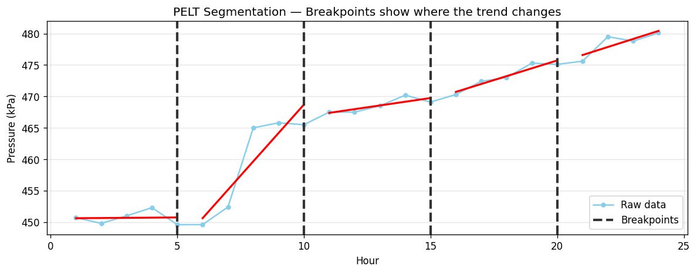

# Drift & Change Point Detection — A Layman's Primer

## What This Is About

When you monitor a sensor (e.g. pressure, temperature) over time, you want to know: **"Has the behavior changed?"**

These four methods help answer that. In practice, change point / drift detection is commonly used for **anomaly detection**, and often as an **early step** toward failure prediction (e.g., as a feature or trigger for downstream models).

These methods don’t directly predict failures by themselves — they detect **changes** and **drift** in how the sensor behaves.

---

## The Example: 24 Hours of Pressure Data

Imagine a pressure sensor (units: kPa) on a chiller. For 24 hours we get **hourly averages**:

**Hours 1–12**

| Hour   | 1   | 2   | 3   | 4   | 5   | 6   | 7   | 8    | 9   | 10  | 11  | 12  |
|--------|-----|-----|-----|-----|-----|-----|-----|------|-----|-----|-----|-----|
| Value  | 450.7 | 449.8 | 451.0 | 452.3 | 449.6 | 449.6 | 452.4 | **465.0** | 465.8 | 465.5 | 467.5 | 467.5 |

**Hours 13–24**

| Hour   | 13  | 14  | 15  | 16  | 17  | 18  | 19  | 20  | 21  | 22  | 23  | 24  |
|--------|-----|-----|-----|-----|-----|-----|-----|-----|-----|-----|-----|-----|
| Value  | 468.5 | 470.2 | 469.1 | 470.3 | 472.4 | 473.0 | 475.3 | 475.1 | 475.6 | 479.5 | 478.8 | 480.1 |

**What happened?**
- **Hours 1–7:** Normal, around 450 kPa
- **Hour 8:** Sudden jump to 465
- **Hours 9–24:** Gradual drift upward (about 466 → 480)

---

## The Four Methods — At a Glance

| Method | What it finds | When to use |
|--------|---------------|-------------|
| **PELT** | Where the trend changed (breakpoints) | After you have a batch of data |
| **CUSUM** | Sudden jumps up or down | As each new reading arrives |
| **Page-Hinkley** | Gradual drift over time | As each new reading arrives |
| **Kalman** | How fast the value is trending (slope) | As each new reading arrives |

---

## 1. PELT — Where Did It Change?

PELT (Pruned Exact Linear Time) is an **offline** method that looks back over a batch of data and asks: “Where should I cut this timeline into chunks so that each chunk looks internally consistent — for example, the values stay around the same average level (or follow the same simple trend), instead of switching to a new level/trend?”

Under the hood, it chooses breakpoints that minimize: a **segment cost** (how well each chunk fits a chosen model) plus a **penalty per breakpoint** (so it doesn’t create too many chunks). PELT itself does **not** require “straight-line segments” — that depends on the **cost function** you pick (common choices are “piecewise constant mean” or “piecewise linear trend”).

Because the cost/model is configurable, PELT can find **sudden level shifts** (jumps) and/or **changes in trend** (slope). A one-off spike for 1–2 timesteps is usually treated as an **outlier** rather than a real changepoint, because carving out a tiny segment just for the spike is penalized — but if the penalty is very small (or the model tries hard to fit every point), PELT can still place breakpoints around a spike.

**Runs once** on the full 24 hours.

*Blue line: raw data. Red line: fitted segments. Gray dashed lines: breakpoints.*

**Example result:**

Using a simple **piecewise constant mean** model on the values in this primer, a reasonable segmentation is:

| Segment | Hours  | Typical level | Meaning |
|---------|--------|---------------|---------|
| 1       | 1–7    | ~451 kPa      | Baseline |
| 2       | 8–12   | ~467 kPa      | Post-jump plateau |
| 3       | 13–21  | ~473 kPa      | Higher operating level |
| 4       | 22–24  | ~480 kPa      | Highest level late day |

**Breakpoints:** near **hour 8** (the jump), and possibly later depending on penalty and model choice.

**Step-by-step evaluation**

| Step | What happens |
|------|--------------|
| 1 | Load all 24 values. |
| 2 | Choose what “consistent” means inside a chunk (the segment model). Example: “values stay near one mean” (level shifts) vs “values follow one line” (trend shifts). |
| 3 | For a proposed set of cut points, score each chunk: “how well does this chunk fit the model?” (this is the segment cost). |
| 4 | Add a penalty for each extra breakpoint (to avoid too many segments). |
| 5 | Choose the split that minimizes: fit error + penalty. |
| 6 | Result: breakpoints near hour 8 (and possibly later); each segment gets its own best-fit parameters under the chosen model. |

**What PELT is not designed for (without tweaks):**

- **Real-time alerting:** PELT is typically **offline** (run after you have a batch), not “fire an alarm on the newest point”.
- **Treating single spikes as changepoints:** One-off spikes are usually better handled by **outlier rules**; PELT can over-segment if you tune the penalty too low.
- **Complex recurring patterns (seasonality):** If the signal naturally repeats daily/weekly patterns, you usually need to model that first (or use a model/cost that accounts for it).

---

## 2. CUSUM — Sudden Jump

CUSUM (Cumulative Sum Control Chart) is an **online** method designed for **sudden shifts** (step-changes up or down). The core idea is simple: instead of reacting to one noisy reading, it **adds up evidence** over time. If readings keep landing above a baseline, the “evidence counter” grows; if they go back to normal, the counter shrinks back toward zero.

This primer uses a practical variant: at each hour we look at a recent window, compute a rolling mean and standard deviation, turn the newest reading into a **scaled deviation** `s = (x - mean) / std`, and then accumulate that deviation with a small drift term `k`. When the accumulated evidence crosses a threshold `h`, we flag a change.

Because it accumulates evidence, CUSUM is usually **not triggered by a single random spike** (1–2 timesteps) unless that spike is extremely large or your thresholds are very sensitive. It’s meant to fire when the shift is **sustained**.

**Runs at each hour** as new data arrives.

**Example result:**

| Hour | Value | CUSUM alert? |
|------|-------|---------------|
| 1–9 | 450–466 | No |
| 10 | 466 | **Yes** (cumulative deviation exceeded threshold) |
| 11–24 | 467–480 | Yes |

CUSUM fires around **hour 10** — a few hours after the jump at hour 8, once the cumulative deviation is large enough.

**Step-by-step evaluation**

Uses a rolling window of the last 8 hours. At each hour: `s = (value - mean) / std`, then:

- `cusum_pos = max(0, cusum_pos + s - k)` (evidence for an upward shift)
- `cusum_neg = min(0, cusum_neg + s + k)` (evidence for a downward shift; kept negative in this table)

In this example we use `k = 0.5` (reference/drift term) and `h = 5` (threshold) in the same scaled units as `s`.

Alert when `cusum_pos > h` for an upward shift (and similarly you could alert on `cusum_neg < -h` for downward shifts).

**What CUSUM is not good for (without tweaks):**

- **Slow drift only:** CUSUM is primarily for **step changes**. It can react to drift if the drift is sustained, but Page‑Hinkley is usually a better fit for “creeping mean shift”.
- **A baseline that keeps moving:** If your “normal” mean/std changes with load, time of day, or season, a simple rolling window can cause false alarms unless you normalize for those factors.
- **Natural periodic patterns:** If the signal has strong daily/weekly cycles, CUSUM can repeatedly trigger unless you remove/ model seasonality first.
- **Isolated sensor glitches:** CUSUM is less sensitive to 1–2 point spikes than a simple threshold, but very large glitches can still push it over the threshold.

| Hour | Value | Mean | Std | s (scaled) | cusum_pos | cusum_neg | Alert? |
|------|-------|------|-----|------------|-----------|-----------|--------|
| 1–4 | 451–452 | — | — | — | 0 | 0 | No (warming up) |
| 5 | 449.6 | 450.7 | 1.0 | −1.12 | 0 | −0.62 | No |
| 6 | 449.6 | 450.5 | 1.0 | −0.93 | 0 | −1.05 | No |
| 7 | 452.4 | 450.8 | 1.1 | 1.46 | 0.96 | 0 | No |
| 8 | **465.0** | 452.6 | 4.8 | **2.58** | 3.04 | 0 | No |
| 9 | 465.8 | 454.4 | 6.4 | 1.77 | 4.31 | 0 | No |
| 10 | 465.5 | 456.4 | 7.1 | 1.29 | **5.10** | 0 | **Yes** |
| 11 | 467.5 | 458.5 | 7.6 | 1.19 | 5.79 | 0 | Yes |
| 12 | 467.5 | 460.4 | 7.7 | 0.93 | 6.22 | 0 | Yes |
| 13–24 | 469–480 | 463–476 | 2–7 | 0.8–1.9 | 6.6–16.8 | 0 | Yes |

---

## 3. Page-Hinkley — Gradual Drift

The Page–Hinkley test is an **online** method meant for **gradual drift / sustained change** rather than a single sudden jump. It works like an “evidence meter” for the mean: each new point contributes a little evidence that the average level has moved, and that evidence accumulates over time.

In this primer, we compare each new reading to a rolling mean (and subtract a tiny tolerance `delta` so tiny noise doesn’t accumulate), and we keep a running cumulative deviation. We also remember the lowest (most negative) cumulative deviation we’ve ever seen; the gap between “where we are now” and that minimum tells us how far we’ve drifted upward. When that gap crosses a threshold `lambda`, we raise an alert.

Because it needs **persistence**, Page–Hinkley usually **does not** trigger on a 1–2 timestep random spike unless it is extremely large. It’s designed to trigger when the series stays “a bit higher than normal” for long enough that it stops looking like random fluctuation.

**What Page–Hinkley is not good for (without tweaks):**

- **Instant detection of a jump:** It usually triggers **after** the change persists (it’s intentionally “slow to trust”), so it can lag a sharp jump compared to CUSUM.
- **Strong seasonality:** Daily/weekly cycles can look like “mean change” unless you model/remove seasonality.
- **Frequent missing data / irregular sampling:** The accumulation assumes roughly regular updates; gaps can distort the statistic unless handled.

**Runs at each hour** as new data arrives.

**Example result:**

| Hour | Value | Page-Hinkley alert? |
|------|-------|---------------------|
| 1–9 | 450–466 | No |
| 10 | 466 | **Yes** (drift exceeded threshold) |
| 11–24 | 467–480 | Yes |

Page-Hinkley also fires around **hour 10**, as the sustained upward drift becomes clear.

**Step-by-step evaluation**

At each hour: `diff = value - mean - δ` (δ=0.01), add to `cum_dev`, track `min_dev`. Alert when `cum_dev − min_dev > λ` (λ=30).

**How min_dev is set:**
- **Start:** `min_dev = 0`, `cum_dev = 0`
- **Each hour:** (1) `cum_dev = cum_dev + diff`, (2) `min_dev = min(min_dev, cum_dev)` — so min_dev is the lowest value cum_dev has ever reached. It acts as a floor; the gap `cum_dev − min_dev` measures how far cum_dev has risen above that floor.

| Hour | Value | Mean | diff | cum_dev | min_dev | gap (cum−min) | Alert? |
|------|-------|------|------|---------|---------|---------------|--------|
| 1–4 | 451–452 | — | — | 0 | 0 | 0 | No (warming up) |
| 5 | 449.6 | 450.7 | −1.09 | −1.09 | −1.09 | 0 | No |
| 6 | 449.6 | 450.5 | −0.91 | −2.00 | −2.00 | 0 | No |
| 7 | 452.4 | 450.8 | 1.62 | −0.38 | −2.00 | 1.62 | No |
| 8 | **465.0** | 452.6 | **12.44** | 12.06 | −2.00 | 14.06 | No |
| 9 | 465.8 | 454.4 | 11.35 | 23.41 | −2.00 | 25.41 | No |
| 10 | 465.5 | 456.4 | 9.09 | 32.50 | −2.00 | **34.50** | **Yes** |
| 11 | 467.5 | 458.5 | 9.03 | 41.53 | −2.00 | 43.53 | Yes |
| 12 | 467.5 | 460.4 | 7.13 | 48.66 | −2.00 | 50.66 | Yes |
| 13–24 | 469–480 | 463–476 | 2–6 | 54–94 | −2.00 | 56–96 | Yes |

---

## 4. Kalman — Steep Trend

The Kalman filter is an online method that estimates the current trend (slope) of the series. It models the value as a linear function of time: value ≈ slope×t + intercept. At each step it predicts the value, compares to the actual, and uses the error to update slope and intercept recursively (no full best-fit line). The slope estimate tells us how fast the value is rising or falling. If the slope exceeds a threshold, an alert is raised.

**Runs at each hour** as new data arrives.

**Example result:**

| Hour | Value | Slope (approx) | Alert? |
|------|-------|----------------|--------|
| 1–4 | 450–452 | ~0 | No |
| 5–9 | 450–466 | High (catching the jump) | No (needs 2 of 3) |
| 10–24 | 466–480 | High | **Yes** (with others) |

Kalman reports a strong upward trend from hour 10 onward.

**Step-by-step evaluation**

At each hour: predict `y_hat` from slope×t + intercept, compute error = value − y_hat, update slope and intercept.

**How y_hat is predicted:** `y_hat = t × slope + intercept`. For example, at hour 6 with slope=83.26 and intercept=16.65: `y_hat = 6×83.26 + 16.65 = 516`.

**Where t, slope, intercept, and K come from:**
- **t:** Hour index (1, 2, 3, … 24). Incremented at the start of each update.
- **slope, intercept:** Stored in state `x = [slope, intercept]`. **Start:** `x = [0, 0]`. **Each hour:** `x = x + K × (value − y_hat)` — the error corrects slope and intercept.
- **K:** Kalman gain (K_slope, K_intercept). Controls how much the error adjusts slope vs intercept. Shown in the table.

**How slope and intercept are calculated (not best-fit line):**

The Kalman filter does **not** fit a best-fit line to all data at each step. Instead it updates **recursively**:

- **Start:** slope=0, intercept=0
- **Each hour:**  
  - `slope_after = slope_before + K_slope × Error`  
  - `intercept_after = intercept_before + K_intercept × Error`  

So slope and intercept are updated incrementally from the prediction error. No full least-squares fit — just a small correction each step.

**Why y_hat and intercept matter if the alert is slope-only?**

We alert on slope, but we need y_hat and intercept to **compute the Error** that updates the slope:

1. **y_hat** = t×slope + intercept (our prediction)
2. **Error** = value − y_hat (how wrong we were)
3. **slope_after** = slope_before + K_slope × Error

Without a good prediction (y_hat), we wouldn't know the Error. Without the intercept, y_hat would be wrong (e.g. we'd predict t×slope only, which misses the baseline level). So intercept and y_hat are needed to get a meaningful Error, which then updates the slope. The slope we alert on depends on that chain.

**How slope_before and slope_after are calculated:**
- **slope_before:** The slope from the *previous* hour. At hour 5 it is 0 (start). At hour 6 it is 83.26 (the slope we had after hour 5).
- **slope_after:** `slope_after = slope_before + K_slope × Error`. Example at hour 6: slope_before=83.26, K_slope=0.11, Error=−66 → slope_after = 83.26 + 0.11×(−66) = **76.09**.

**How slope (kPa/h) is computed (same idea, different formulation):**

Both **slope (after)** and **slope (kPa/h)** estimate the same thing — how fast the value is trending. The table uses a Kalman formulation where slope and intercept live in a different scale. To get slope in kPa/hour, we use a **level + slope** tracker (e.g. alpha-beta):

- `level = level + α × (value − level)` — smooth the value
- `slope = slope + β × (value − level − slope)` — update slope from the "surprise" (value − level − slope)

Here `level` and `value` are in kPa, and we update each hour, so `slope` stays in kPa/hour. Start: level = value₁, slope = 0. Each new `value` gives a new `slope`. The **slope (kPa/h)** column in the table is this slope. Same recursive idea as slope (after), but the formulation keeps units as kPa/hour.

**Why the threshold 0.5 kPa/hour?** The alert is when **slope exceeds a threshold** (e.g. slope > 0.5), not when slope is increasing. In our example, slope rises from 0.26 → 0.33 → 0.49 → 0.53 → … → 0.92, slopes 0.26–0.49 are below 0.5; 0.53–0.92 are above. We alert when slope crosses 0.5 (around hour 15). The threshold 0.5 kPa/hour is a tuning choice — for a flat baseline, 0.5 means 12 kPa drift over 24 hours. The step-by-step table below uses different units (slope 83, 76, etc.) for illustration; the slope values that matter for the alert are in kPa/hour (0–0.92) and cross 0.5 around hour 15. The table's slope column (83, 76, 45, etc.) uses a different internal scale, not kPa/hour

| Hour | Value | t | slope (before) | intercept (before) | y_hat = t×slope+intercept | K (slope, intercept) | Error | Slope (after) | slope (kPa/h) | Alert? (slope &gt; 0.5) |
|------|-------|---|-----------------|--------------------|---------------------------|----------------------|-------|---------------|---------------|--------------------------|
| 1–4 | 451–452 | — | — | — | — | — | — | — | ~0 | No (warming up) |
| 5 | 449.6 | 5 | 0 | 0 | 5×0+0 = **0** | 0.19, 0.04 | 449.6 | 83.26 | −0.00 | No |
| 6 | 449.6 | 6 | 83.26 | 16.65 | 6×83.26+16.65 = **516** | 0.11, −0.06 | −66 | 76.09 | −0.01 | No |
| 7 | 452.4 | 7 | 76.09 | 20.75 | 7×76.09+20.75 = **553** | 0.08, −0.12 | −101 | 67.67 | 0.01 | No |
| 8 | **465.0** | 8 | 67.67 | 33.36 | 8×67.67+33.36 = **575** | 0.07, −0.17 | −110 | 59.95 | 0.10 | No |
| 9 | 465.8 | 9 | 59.95 | 51.55 | 9×59.95+51.55 = **591** | 0.06, −0.19 | −125 | 52.29 | 0.19 | No |
| 10 | 465.5 | 10 | 52.29 | 75.29 | 10×52.29+75.29 = **598** | 0.05, −0.20 | −133 | **45.18** | 0.26 | No |
| 11 | 467.5 | 11 | 45.18 | 101.95 | 11×45.18+102 = **599** | 0.05, −0.20 | −131 | 38.99 | 0.33 | No |
| 12 | 467.5 | 12 | 38.99 | 128.75 | 12×39+129 = **597** | 0.04, −0.20 | −129 | 33.63 | 0.38 | No |
| 13–24 | 469–480 | 13–24 | 9–34 | 155–317 | 544–591 | 0.01–0.04 | −75 to −122 | 8.7–29.1 | 0.44–0.92 | Yes (from h15) |

*Slope (after): Kalman state (different scale). **slope (kPa/h)**: from level+slope tracker above; drift rate in kPa/hour; alert when &gt; 0.5.*

---

## Combined Alert (How We Use Them Together)

In practice we often say: **alert only if at least 2 of the 3 online methods (CUSUM, Page-Hinkley, Kalman) agree.**

| Hour | CUSUM | Page-Hinkley | Kalman slope | Combined alert? |
|------|-------|--------------|--------------|-----------------|
| 1–9 | No | No | Low | No |
| 10–24 | Yes | Yes | High | **Yes** |

---

## Summary Table

| Method | Detects | Example trigger |
|--------|---------|-----------------|
| **PELT** | Where trend changed | Breakpoint at hour 8 (flat → rising) |
| **CUSUM** | Sudden jump | Jump from 452 → 465 at hour 8 |
| **Page-Hinkley** | Gradual drift | Drift from 465 → 480 over hours 9–24 |
| **Kalman** | Steep trend | Slope ~1 kPa/hour in hours 10–24 |

---
